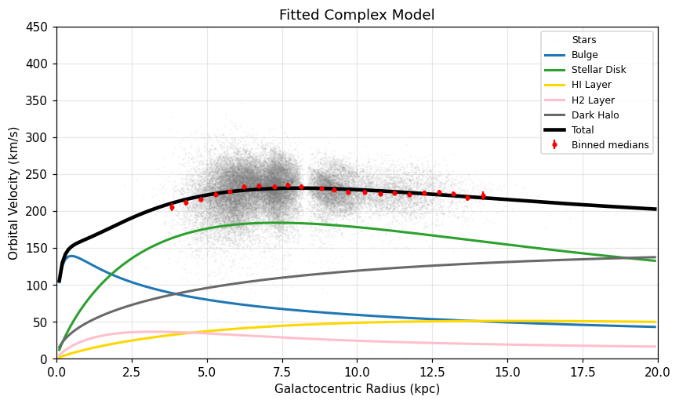

# The Milky Way's Rotation Curve, measured from Gaia

[](https://OWNER.github.io/REPO/)
[](https://colab.research.google.com/github/OWNER/REPO/blob/main/Rotation.ipynb)
[](https://nbviewer.org/github/OWNER/REPO/blob/main/runs/2026-09-17_Rotation.ipynb)
[](LICENSE)

**Parag Chettri and Santiago Berumen**

A self-contained notebook that queries the ESA Gaia Archive on its own, turns about 36,000 stars into a Galactocentric rotation curve, fits four models to it, and then tests those models on an independent sample of *different* stars from an earlier data release. No pre-packaged data files, no hidden steps: run it and it rebuilds every number from the archive up.



## Results from the run of 17 September 2026

| Model | k | χ² | χ²/dof | ΔBIC | χ² per bin on the held-out DR2 stars |
|:--|--:|--:|--:|--:|--:|
| Keplerian point mass | 1 | 3676.6 | 175.07 | 3651.0 | 67.6 |
| Linear | 2 | 88.5 | 4.42 | 66.0 | 3.4 |
| Simple exponential | 2 | 54.9 | 2.74 | 32.4 | 2.9 |
| **Bulge + disks + NFW halo** | **3** | **19.4** | **1.02** | **0.0** | **1.2** |

- 36,608 training stars from Gaia DR3 and 5,971 test stars from Gaia DR2, with **zero overlap** between them on both an identifier check and a 1 arcsecond positional crossmatch
- Circular speed at the Sun: **225.8 ± 0.7 km/s** from the linear fit, 231.0 km/s from the mass model, against 229.0 km/s from Eilers et al. (2019)
- Local dark matter density: **0.20 ± 0.06 GeV/cm³**, inside the 0.2 to 0.6 GeV/cm³ range compiled by Read (2014)
- The same model wins on the training set and on the held-out stars, which is the point of splitting them in the first place

## Run it yourself

```bash
git clone https://github.com/OWNER/REPO.git
cd REPO
pip install -r requirements.txt
jupyter lab Rotation.ipynb        # then: Kernel -> Restart Kernel and Run All Cells
```

Or open it in [Google Colab](https://colab.research.google.com/github/OWNER/REPO/blob/main/Rotation.ipynb) and uncomment the `%pip install` line in the first code cell. You need Python 3.9 or newer and an internet connection.

The first run submits two asynchronous jobs to the Gaia Archive and takes somewhere between 5 and 30 minutes, depending on how busy the archive is. Each job prints its progress. Everything is cached in `DataSets/`, so later runs take seconds. All of the knobs (sample size, bin width, systematic floor, Monte Carlo size, priors) live in a single settings cell near the top.

## What the notebook does

1. **Queries Gaia itself.** Two ADQL queries over the TAP interface, one for DR3 and one for DR2, restricted to stars with radial velocities within 1 degree of the Galactic plane and 5 degrees of the Galactic Center or anticenter direction. Quality cuts: parallax measured at better than 5σ, RUWE below 1.4, and the published parallax zero-point corrections.
2. **Keeps the training and test sets genuinely independent.** Gaia releases are not independent surveys, so the split is done by star rather than by release, using the parity of DR3's `random_index` together with the official `gaiadr3.dr2_neighbourhood` crossmatch. A positional crossmatch on the client side then audits the result.
3. **Transforms to the Galactic Center frame** with the full rotation matrix, checked against `astropy` to better than 0.001 km/s, using modern solar parameters (GRAVITY Collaboration 2022; Reid and Brunthaler 2020; Schönrich et al. 2010).
4. **Builds a binned rotation curve** from median velocities with bootstrap uncertainties.
5. **Propagates the uncertainties properly.** Per-star measurement errors (including the proper-motion correlation), the parallax zero-point, and the solar parameters are each handled separately, and the last two produce a full covariance matrix between bins rather than a single diagonal floor.
6. **Fits and compares four models** on identical footing with χ², AIC and BIC, then scores the trained models on the held-out DR2 stars without refitting.
7. **Turns the winner into physics**: enclosed mass, dark matter fraction, and the local dark matter density.

## What is in this repository

| Path | What it is |
|:--|:--|
| `Rotation.ipynb` | The notebook to run. Outputs are cleared so that the diffs stay readable. |
| `runs/2026-09-17_Rotation.ipynb` | A completed run, kept with its outputs and figures. This is what the web page renders. |
| `docs/` | The GitHub Pages site: a landing page plus the rendered run. |
| `pluto/Rotation.jl` | The original interactive Pluto.jl (Julia) edition, with sliders. Open it with `julia deps/build.jl` from inside `pluto/`. |
| `tools/export_page.py` | Regenerates `docs/` from a completed run. |
| `DataSets/` | Where the query cache lands. Empty in git. |

The Julia notebook carries the same analysis and the same interactive sliders, but the correlated error propagation of step 5 exists only in the Python version for now.

## Publishing the page

Pages is served from the `docs/` folder on the default branch. In the repository settings, under **Pages**, choose "Deploy from a branch", then `main` and `/docs`. A workflow in `.github/workflows/pages.yml` is included if you would rather have Actions build and deploy it instead.

After a new run, refresh the site with:

```bash
python tools/export_page.py runs/YOUR_RUN.ipynb     # optionally: --summary results_summary.json
```

Before the first push, point the placeholder links at the real repository:

```bash
python tools/set_repo.py OWNER REPO
```

## Sources

Gaia Collaboration, Vallenari et al. (2023); Gaia Collaboration, Brown et al. (2018); Lindegren et al. (2018, 2021); GRAVITY Collaboration (2022); Reid and Brunthaler (2020); Schönrich, Binney and Dehnen (2010); Eilers et al. (2019); McMillan (2017); Freeman (1970); Hernquist (1990); Navarro, Frenk and White (1996); Bland-Hawthorn and Gerhard (2016); Deason et al. (2019); Read (2014). Full citations with DOIs are in the notebook's reference section.

This work has made use of data from the European Space Agency mission *Gaia* (https://www.cosmos.esa.int/gaia), processed by the Gaia Data Processing and Analysis Consortium (DPAC, https://www.cosmos.esa.int/web/gaia/dpac/consortium). Funding for the DPAC has been provided by national institutions, in particular the institutions participating in the Gaia Multilateral Agreement.

Released under the MIT License. If you use it, the citation metadata is in `CITATION.cff`.
